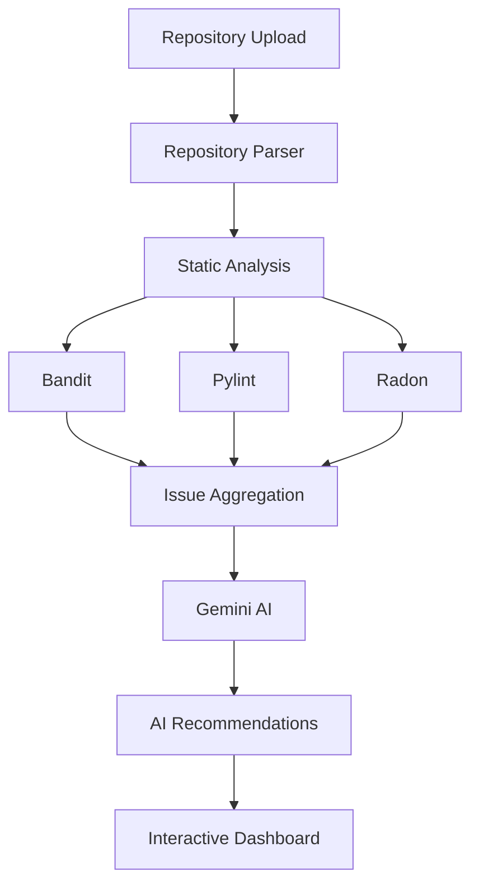

# 🤖 AI-Powered Codebase Auditor

<p align="center">
  <strong>Analyze. Understand. Improve.</strong><br/>
  An AI-powered platform that combines static code analysis with Large Language Models to deliver comprehensive repository audits, security insights, maintainability analysis, and intelligent code recommendations.
</p>

<p align="center">


</p>

---

## 📑 Table of Contents

* Overview
* Why This Project?
* Features
* Architecture
* Workflow
* Tech Stack
* Project Structure
* Getting Started
* Environment Variables
* API Endpoints
* Future Improvements
* Contributing
* License
* Author

---

# 🚀 Overview

**AI-Powered Codebase Auditor** is a full-stack application designed to automate software quality assessment by combining traditional static analysis tools with AI-generated insights.

Instead of relying solely on linting tools or manually reviewing thousands of lines of code, the application aggregates findings from multiple analyzers and enhances them with contextual recommendations generated by Google's Gemini model.

Whether you're reviewing a personal project, auditing an existing codebase, or assessing repository quality before deployment, the platform provides a centralized view of code health, maintainability, and security.

---

# 💡 Why This Project?

Modern development teams often use multiple tools to evaluate code quality:

* Security scanners
* Complexity analyzers
* Linters
* AI assistants

Each tool produces valuable information independently, but developers still need to correlate the results manually.

This project solves that problem by providing a unified platform that:

* Runs multiple static analysis tools
* Aggregates their findings
* Uses AI to explain issues in plain English
* Suggests practical improvements
* Presents everything through a clean web interface

---

# ✨ Key Features

## 🔍 Static Code Analysis

* Security analysis using **Bandit**
* Complexity analysis using **Radon**
* Code quality analysis using **Pylint**
* Repository-wide issue aggregation

---

## 🤖 AI-Powered Insights

* Repository summary generation
* Code quality assessment
* Security recommendations
* Maintainability suggestions
* Architecture observations
* Performance improvement ideas
* Actionable AI explanations

---

## 📊 Interactive Dashboard

* Repository overview
* Severity breakdown
* Complexity metrics
* Security findings
* AI-generated recommendations
* Clean and responsive interface

---

## ⚡ Modern Developer Experience

* FastAPI backend
* React + TypeScript frontend
* RESTful APIs
* Modular architecture
* Responsive UI
* Easy deployment

---

# 🏗️ System Architecture



---

# 🔄 Analysis Workflow

```mermaid
flowchart LR

Repository

-->

Parser

-->

Static Analysis

-->

Issue Aggregation

-->

Gemini AI

-->

Interactive Dashboard
```

---

# 🛠️ Technology Stack

## Frontend

* React
* TypeScript
* Vite
* Tailwind CSS
* React Router

---

## Backend

* FastAPI
* Python
* Uvicorn

---

## AI

* Google Gemini
* LangChain

---

## Static Analysis

* Bandit
* Pylint
* Radon

---

# 📂 Project Structure

```text
AI-Powered-Codebase-Auditor/

├── frontend/
│   ├── src/
│   ├── public/
│   ├── components/
│   └── package.json
│
├── backend/
│   ├── app/
│   ├── analyzers/
│   ├── services/
│   ├── routers/
│   ├── utils/
│   └── requirements.txt
│
├── uploads/
├── reports/
└── README.md
```

---

# ⚙️ Getting Started

## Clone the Repository

```bash
git clone https://github.com/okarin25/AI-Powered-Codebase-Auditor.git

cd AI-Powered-Codebase-Auditor
```

---

## Backend Setup

```bash
cd backend

python -m venv venv
```

### Activate Environment

Windows

```powershell
venv\Scripts\activate
```

Linux / macOS

```bash
source venv/bin/activate
```

Install Dependencies

```bash
pip install -r requirements.txt
```

Run the Server

```bash
uvicorn app.main:app --reload
```

---

## Frontend Setup

```bash
cd frontend

npm install

npm run dev
```

---

# 🔐 Environment Variables

Create a `.env` file inside the backend directory.

```env
GOOGLE_API_KEY=YOUR_GEMINI_API_KEY
```

---

# 📡 API Endpoints

| Method | Endpoint  | Description               |
| ------ | --------- | ------------------------- |
| POST   | `/audit`  | Analyze a repository      |
| GET    | `/status` | Check audit progress      |
| GET    | `/report` | Retrieve generated report |

---

# 📈 Future Improvements

* GitHub OAuth Authentication
* Multi-language Support
* Docker Deployment
* Historical Audit Reports
* CI/CD Integration
* Repository Comparison
* Team Collaboration
* GitHub Action
* VS Code Extension
* PDF Report Export
* Pull Request Review Assistant

---

# 🤝 Contributing

Contributions are welcome.

If you have ideas for improvements or discover a bug:

1. Fork the repository
2. Create a feature branch
3. Commit your changes
4. Open a Pull Request

---

# 📄 License

This project is licensed under the MIT License.

---

# 👨‍💻 Author

**Arpit Vishwakarma**

GitHub: https://github.com/okarin25

---

<p align="center">

⭐ If you found this project useful, consider giving it a star.

</p>
